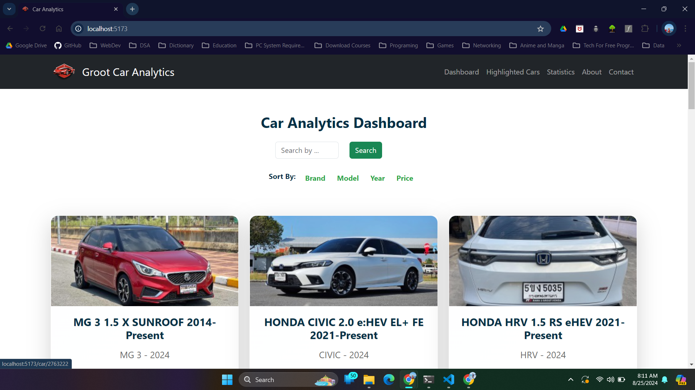

# React + Vite

This template provides a minimal setup to get React working in Vite with HMR and some ESLint rules.

Currently, two official plugins are available:

- [@vitejs/plugin-react](https://github.com/vitejs/vite-plugin-react/blob/main/packages/plugin-react/README.md) uses [Babel](https://babeljs.io/) for Fast Refresh
- [@vitejs/plugin-react-swc](https://github.com/vitejs/vite-plugin-react-swc) uses [SWC](https://swc.rs/) for Fast Refresh

Groot Car Analytics Project

Features:
1. Dashboard Page (Search, Sort, Hightlight, scroll to up and Hightlighted cars will be stored to Local Storage)
2. Hightlighted Cars Page (This page shows hightlighted cars. In this page, there is also remove button to remove hightlighted cars from the page)
3. Statistic Page (This page shows tables by the title of Number of Cars and Values by Brands and Models and shows Pie chart and Stackedbar by modles of each branch)
4. About Page (About Our Projects)
5. Contact Page (For Contact and Feedback from users. That feedback or review values would be stored on Local Storage)

Team Members

1. Oguejiofor George Obinna
ID: 6520283
Email: u6520283@au.edu
Phone: 0632100659

2. Min La Wee Chan
ID: 6520189
Email: u6520189@au.edu
Phone: 0649916003

3. Sai Hein Thu Ya Soe
ID: 6520051
Email: u6520051@au.edu
Phone: 0661078960

 

